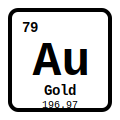
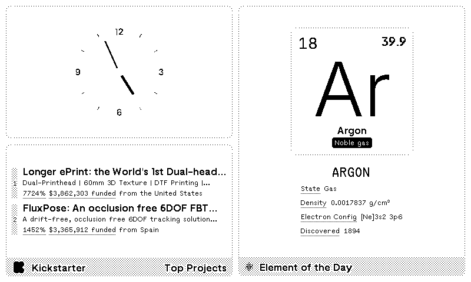

# Element of the Day 🧪

Learn chemistry one element at a time! Display a different element from the Periodic Table on your TRMNL e-ink device.

> "The elements are the alphabet of nature." – Dmitri Mendeleev

## Install

**[→ Install Element of the Day](https://usetrmnl.com/recipes)**

1. Visit [TRMNL Plugins](https://usetrmnl.com/plugins)
2. Search for "**Element of the Day**"
3. Click **Install**
4. Configure your preferred **Display Mode**:
   - **Hourly Random**: New element every hour (default)
   - **Daily Rotation**: Cycles through all 118 elements based on day of year
5. Add to your [Playlist](https://usetrmnl.com/playlists)

## Demo

| Layout | Preview |
|--------|---------|
| **Full** |  Responsive 1-3 column grid with element card and 12 properties |
| **Half Horizontal** |  Compact horizontal layout with 6 properties in 2x3 grid |
| **Half Vertical** |  Vertical layout with card and 4 essential properties |
| **Quadrant** |  Minimal view with card and 2 properties |

## Features

- 🔬 **118 Elements** - Complete periodic table coverage
- ⏰ **Flexible Display** - Hourly or daily rotation modes
- 📊 **Rich Data** - Atomic properties, electron configuration, discovery info
- 🎨 **Multiple Layouts** - Four optimized size options
- ⚡ **Fast Updates** - Static data via GitHub Pages
- 📱 **E-ink Optimized** - Clean design for all TRMNL devices

### Element Properties

Each element includes atomic number, symbol, name, mass, category, state, electron configuration, melting/boiling points, density, and discovery year.

---

**For Developers:** Want to fork or customize this plugin? See [docs/DEVELOPER.md](docs/DEVELOPER.md)

**License:** See [LICENSE](LICENSE) for details.
